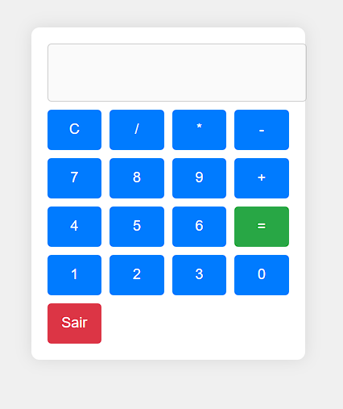

# 🧮 Calculadora Estilosa

Uma calculadora simples e estilosa desenvolvida com HTML, CSS e JavaScript. Este projeto foi criado para demonstrar habilidades em desenvolvimento web e design de interfaces.

## Funcionalidades

- **➕ Operações Básicas**: A calculadora suporta adição, subtração, multiplicação e divisão.
- **🖱️ Interface Intuitiva**: A interface é amigável e fácil de usar, com botões grandes e bem definidos.
- **🚪 Botão "Sair"**: Permite que o usuário feche a calculadora com um alerta de confirmação.
- **🎨 Estilo Moderno**: A calculadora possui um design moderno e responsivo, com cores suaves e sombras.

## Tecnologias Utilizadas

- **🌐 HTML**: Para a estrutura da página.
- **🎨 CSS**: Para o estilo e layout da calculadora.
- **📜 JavaScript**: Para a lógica de cálculo e interatividade.

## Como Usar

1. Clone o repositório:
   ```bash
   git clone https://github.com/brodyandre/calculadora-estilosa.git
Navegue até o diretório do projeto:

cd calculadora-estilosa
Abra o arquivo index.html em um navegador web.

Estrutura do Projeto

calculadora-estilosa/

│

├── index.html      # Arquivo HTML principal

├── styles.css      # Estilos da calculador

└── script.js       # Lógica da calculadora

Captura de Tela


## Captura de Tela



## Contribuição

Sinta-se à vontade para contribuir com melhorias ou correções. Para isso, siga os passos abaixo:

Faça um fork do projeto.

Crie uma nova branch:

git checkout -b minha-nova-feature

Faça suas alterações e commit:

git commit -m 'Adiciona nova feature'
Envie para o repositório remoto:

git push origin minha-nova-feature

Abra um Pull Request.

## Autor
Este projeto foi criado por Luiz Andre. 

Você pode me encontrar no GitHub como brodyandre.
